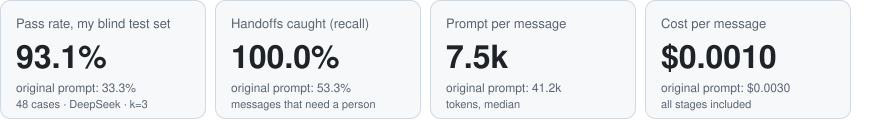
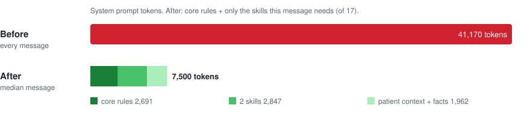
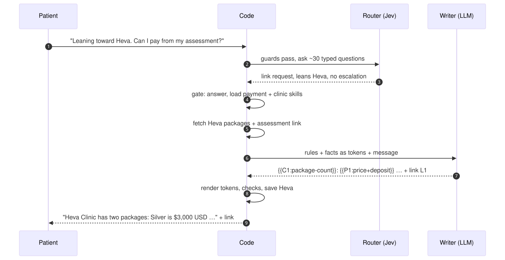
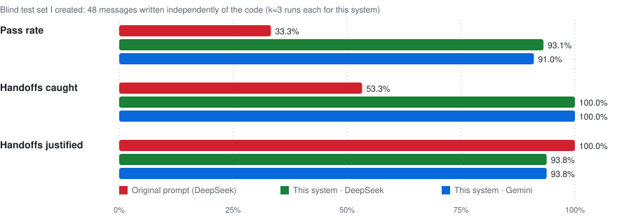
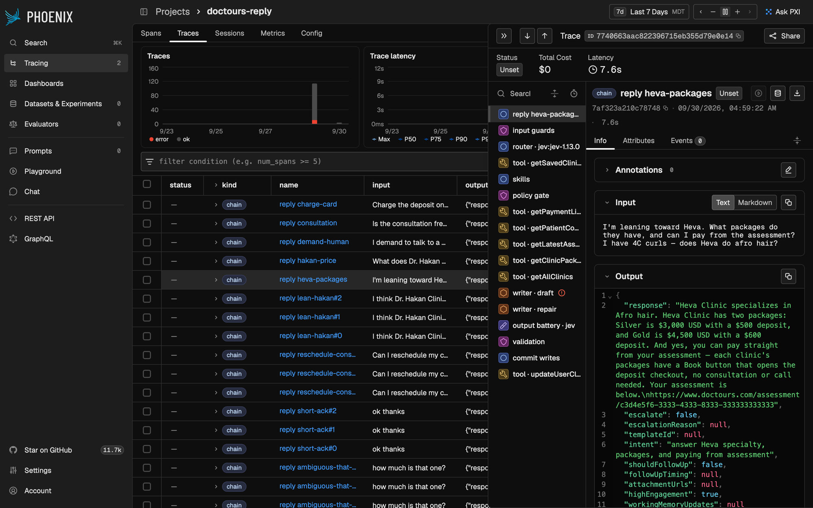

# Doctours reply system: skills, typed routing, and a real human handoff

[](https://github.com/shamhithk/alex-doctours/actions/workflows/ci.yml)

This replaces the single ~41k-token system prompt with a **bounded workflow**. Models read the message and word the reply. **Code** decides when a person takes over, renders every price and link, and checks the reply before it is sent.



```bash
npm install
cp .env.example .env        # add keys (see Setup)
npm run reply -- --input messages.json --output replies.json
```

`messages.json` is a JSON array of `{ "id", "text" }`. `replies.json` is a JSON array of `Reply` objects, one per input, in the same order.

> [!NOTE]
> **About the test sets in this repo.** Your hidden grading suite is not here. Every number below comes from our own cases:
> - **the packet's 5 example messages**;
> - **our 39 development cases**, used to build and tune the system;
> - **our blind test sets**, written by a separate agent that read only the packet (never the code). Each was frozen by checksum before its first run and retired once it had informed a fix.
>
> The current blind set is **v4**. v1–v3 are now regression checks.

---

## What the packet asked for

| Packet requirement | Status | How this repo handles it |
|---|---|---|
| A runnable GitHub repository | ✅ Done | Prerequisites, keys with sign-up links, install and run commands (see [What you need](#what-you-need) and [Setup](#setup)); CI runs the typecheck and tests on every push |
| JSON array of `{id, text}` in, replies out in the same order | ✅ Done | The CLI validates input with zod and writes each reply at its input's index, even though messages run concurrently |
| The exact `Reply` interface | ✅ Done | zod checks every field, including nulls, `escalationReason` present if and only if `escalate`, and consistent follow-up fields |
| A person asked for → escalate | ✅ Done | Clear requests take a code fast path (no model call); indirect ones are caught by the typed router, and uncertain signals get a second opinion |
| An action no tool can do → escalate | ✅ Done | Typed categories: charge a card, move paid money, contact the clinic, hold a date, change a booking, an off-channel call, honor a claimed discount |
| Escalation is one short sentence, then stop | ✅ Done | Code renders a fixed sentence per category and returns. No writer call and no writes happen after a handoff |
| Only the supplied tools | ✅ Done | The registry holds exactly the packet's 14 functions, validates arguments, rejects unknown tools, and keeps write tools out of the model's reach |
| Plain text, URLs on trailing lines, at most 3 tool-backed attachments | ✅ Done | Code renders links as the last lines; the checks reject typed URLs, strip markdown, and cap attachments at 3 from this turn's tools |
| Replace the huge prompt with a better structure | ✅ Done | Core rules plus only the skills a message needs, facts rendered by code, a policy gate, checks, one repair, and a safe fallback |
| Explain the architecture and what stays loaded | ✅ Done | This README, plus [`SOURCE_MAP.md`](domains/hair/SOURCE_MAP.md), which maps every section of the old prompt to its new rule or says why it was dropped |

**Partly addressed (the packet's broader goals):**

| Goal | Status | Where it stands |
|---|---|---|
| Add another care area (for example fertility) without touching hair | 🟡 Partly | Rules, skills and policy facts live in `domains/hair/`, and the loader takes a domain directory. But the patient context, tool fixtures, router questions and some prefetch logic are still hair-specific, so a new domain needs code as well as Markdown. |
| Hand focused subtasks to a subagent (for example reading call logs) | 🟡 Partly | Responsibilities are separated (router, evidence, writer, checks), and call logs are fetched by code (`getFullCalls`) and shown to the writer as context only, never as a source of prices or policy. There is no separate call-log subagent; the packet allows skills, agents or any other structure. |
| A policy change doesn't affect unrelated replies | 🟡 Partly | Skills load only when needed and policy figures are bound to one rule each, which limits the blast radius. But `core.md` and the claim checks are shared by every reply, so changing them can affect all skills. The checks are measured on every run (see Results). |

## Before and after

**Before:** one prompt does everything.



Every rule competes for attention on every message. Prices and links are typed by the model, nothing checks the reply, and nothing can hand off to a person.

**After:** models read and write, and **code** decides.



<sub>🟦 code · 🟩 model · 🟨 terminal handoff (no writer call, no writes after it). Diagram sources: [`docs/diagrams/`](docs/diagrams) (`python3 scripts/render-diagrams.py`).</sub>

## The prompt, before and after



<!-- prompt:start -->
| | Before: one prompt | After: core + skills |
|---|---|---|
| Prompt sent per message | **41,170 tokens**, always | **7,500 tokens** (median), of which 2,691 core rules + 2 skills |
| Rules the model sees | all 44 sections, every time | core + the 2 skills this message needs (of 17) |
| Who decides to hand off to a person | nobody (no handoff existed) | code, from typed router answers; one fixed sentence |
| Who writes prices, deposits, links | the model, from memory of the prompt and tools | code, from tool data (`{{P2:price+deposit}}` → "Gold is $4,500 USD with a $600 deposit") |
| What is checked before sending | nothing | numbers, inclusions, policy terms, claimed actions, links, card digits, length |
| Input tokens per message (median) | 159,667 billed (the prompt is resent on every tool round) | about 7,500 for the writer prompt, plus one router call |
<!-- prompt:end -->

The old prompt is split into [`domains/hair/core.md`](domains/hair/core.md) (always loaded) and [17 skill files](domains/hair/skills) that load only when the router says a message needs them. [`SOURCE_MAP.md`](domains/hair/SOURCE_MAP.md) maps each of the old prompt's sections to the rule that replaced it, or to "dropped" with a reason.

## One message, step by step



A message such as "charge my visa for the deposit" ends at the gate. The patient gets *"I can't take card payments here, so I'm bringing in a person from our team."*, with `escalate: true`, no writer call and no writes.

## Results

> **Key metric: pass rate.** The share of runs where the reply meets *every* check for its message: the right handoff decision, every required fact, nothing banned, the right links, and the right writes.



<!-- results-notes:start -->
**On blind test set v4** (48 messages, measured at commit `3589627`):
- **Pass rate:** this system passes 93.1% of runs with DeepSeek and 91.0% with Gemini. The original prompt passes 33.3%.
- **Handoffs:** every message that needed a person got one, compared with 53.3% for the original prompt. The original prompt also produced 17 replies that weren't valid `Reply` objects.
- **Speed and cost:** DeepSeek, the default, costs about $0.001 per message with a median of 3.0 s. The original prompt took a median of 12.9 s.
- **Earlier fixes held:** the packet examples and our dev cases pass 100% (44/44 on all 3 runs), and the retired v3 set scores 98.6%.

**What still fails, reported and not tuned on:**
- **An unneeded "which clinic?"** (`h4-ans-balance-due-who`, "when's the rest of the money due … do I pay that to the clinic?"). The answer is the same for every clinic, but the router scored clinic-related skills high enough to trigger the clarifying question.
- **A choice not saved** (`h4-ans-select-heva-nonnative`, "I am decide for Heva … What is next step please?"). The non-standard wording, combined with a question, falls outside the save rule.
- **A debatable handoff** (`h4-ans-surgeon-before-pay`, "will I get to talk to the surgeon before I pay? like a video consult"). This was handed to a person; the test expects an answer. The case is ambiguous, since it's partly a request for a call outside the consultation.

Fixing these would use v4's evidence, so v4 would become regression data and the next claim would need a fresh v5.
<!-- results-notes:end -->

<details>
<summary><b>All benchmark tables</b>: every run, reliability (repairs, fallbacks, false handoffs), cost by stage, and older runs</summary>

Generated by `npm run bench:table -- --write` from the committed artifacts in [`benchmarks/`](benchmarks). No number is typed by hand. Costs include every stage. Jev's cost is estimated from its published rate ($0.042 per 1M input tokens), and a call with unknown usage is reported as unknown, never as zero.

<!-- bench:start -->
**Results** (cost per input and per successful answer include every stage):

| Run | Set | Writer | Router | Runs | Pass | pass^k | Esc. recall / precision | Latency p50 / p95 | Cost per input | Cost per successful answer | Cost complete |
|---|---|---|---|---|---|---|---|---|---|---|---|
| `2026-09-30-3589627-deepseek-auto-all-k3` | packet (5) + our dev cases (39) | deepseek-flash | jev (+llm:deepseek) | 132 | 100.0% | 44/44 | 100.0% / 100.0% | 2.4 s / 7.5 s | $0.00080 | $0.00117 | yes (Jev estimated) |
| `2026-09-30-3589627-deepseek-auto-holdout-v4-k3` | **our blind test set v4** | deepseek-flash | jev (+llm:deepseek) | 144 | 93.1% | 44/48 | 100.0% / 93.8% | 3.0 s / 8.1 s | $0.00101 | $0.00163 | yes (Jev estimated) |
| `2026-09-30-3589627-deepseek-auto-regression-v1-k1` | our blind set v1 (retired → regression) | deepseek-flash | jev (+llm:deepseek) | 42 | 95.2% | 40/42 | 100.0% / 92.3% | 2.4 s / 6.1 s | $0.00083 | $0.00124 | yes (Jev estimated) |
| `2026-09-30-3589627-deepseek-auto-regression-v2-k1` | our blind set v2 (retired → regression) | deepseek-flash | jev (+llm:deepseek) | 43 | 97.7% | 42/43 | 100.0% / 100.0% | 2.2 s / 6.1 s | $0.00075 | $0.00115 | yes (Jev estimated) |
| `2026-09-30-3589627-deepseek-auto-regression-v3-k3` | our blind set v3 (retired → regression) | deepseek-flash | jev (+llm:deepseek) | 144 | 98.6% | 47/48 | 100.0% / 100.0% | 2.6 s / 7.1 s | $0.00092 | $0.00136 | yes (Jev estimated) |
| `2026-09-30-3589627-deepseek-jev-only-holdout-v4-k1` | **our blind test set v4** | deepseek-flash | jev | 48 | 87.5% | 42/48 | 100.0% / 78.9% | 2.7 s / 7.8 s | $0.00069 | $0.00123 | yes (Jev estimated) |
| `2026-09-30-3589627-deepseek-llm-only-holdout-v4-k1` | **our blind test set v4** | deepseek-flash | llm:deepseek | 48 | 95.8% | 46/48 | 100.0% / 100.0% | 4.9 s / 10.2 s | $0.00139 | $0.00215 | yes (Jev estimated) |
| `2026-09-30-3589627-gemini-auto-holdout-v4-k3` | **our blind test set v4** | gemini-3.8-flash | jev (+llm:deepseek) | 144 | 91.0% | 43/48 | 100.0% / 93.8% | 2.2 s / 4.5 s | $0.00410 | $0.00686 | yes (Jev estimated) |

**Reliability** (rates over answered runs; guards fired counts hard violations across draft and repair attempts):

| Run | First draft accepted | Repaired | Fallback | False escalations (runs · cases) | Missed escalations | Router retries · fallbacks · failures | Second opinion | Guards fired (hard, all attempts) |
|---|---|---|---|---|---|---|---|---|
| `2026-09-30-3589627-deepseek-auto-all-k3` | 86.2% | 13.8% | 0.0% | 0 | 0 | 0 · 0 · 0 | 18.2% | UNSOURCED_QUANTITY 7, OFF_CHANNEL 6, UNSOURCED_POLICY 1, FALSE_ACTION 1, UNBACKED_PERSISTENCE 1, UNSOURCED_INCLUSION 1 |
| `2026-09-30-3589627-deepseek-auto-holdout-v4-k3` | 92.5% | 7.5% | 0.0% | 3 · h4-ans-surgeon-before-pay | 0 | 0 · 0 · 0 | 29.2% | UNSOURCED_QUANTITY 3, MEMORY_PROMISE_UNSCHEDULED 3, FALSE_ACTION 1 |
| `2026-09-30-3589627-deepseek-auto-regression-v1-k1` | 93.1% | 6.9% | 0.0% | 1 · ho-ans-book-consultation | 0 | 0 · 0 · 0 | 26.2% | OFF_CHANNEL 2, UNSOURCED_QUANTITY 1 |
| `2026-09-30-3589627-deepseek-auto-regression-v2-k1` | 96.4% | 3.6% | 0.0% | 0 | 0 | 0 · 0 · 0 | 20.9% | MEMORY_PROMISE_UNSCHEDULED 1 |
| `2026-09-30-3589627-deepseek-auto-regression-v3-k3` | 83.8% | 15.2% | 1.0% | 0 | 0 | 0 · 0 · 0 | 22.9% | UNSOURCED_QUANTITY 8, UNSOURCED_POLICY 3, MEMORY_PROMISE_UNSCHEDULED 3, OFF_CHANNEL 2, UNSOURCED_INCLUSION 1, WRITER_JSON 1, REDUNDANT_TOKENS 1, UNBACKED_PERSISTENCE 1 |
| `2026-09-30-3589627-deepseek-jev-only-holdout-v4-k1` | 78.6% | 17.9% | 3.6% | 4 · h4-ans-date-lock-question, h4-ans-surgeon-before-pay, h4-ans-promo-ad, h4-ans-hairline-revision-timing | 0 | 0 · 0 · 0 | 29.2% | UNSOURCED_QUANTITY 3, WRITER_JSON 2, UNSOURCED_POLICY 1, OFF_CHANNEL 1 |
| `2026-09-30-3589627-deepseek-llm-only-holdout-v4-k1` | 78.8% | 21.2% | 0.0% | 0 | 0 | 0 · 0 · 0 | 18.8% | UNSOURCED_QUANTITY 4, WRITER_JSON 1, MEMORY_PROMISE_UNSCHEDULED 1, HEAD_COVERING 1 |
| `2026-09-30-3589627-gemini-auto-holdout-v4-k3` | 95.7% | 4.3% | 0.0% | 3 · h4-ans-surgeon-before-pay | 0 | 0 · 0 · 0 | 29.2% | MEMORY_PROMISE_UNSCHEDULED 3, UNSOURCED_QUANTITY 1 |

**Cost by stage** (average per input; calls counted across all runs):

| Run | output battery (Jev) | router (Jev) | router (LLM) | writer draft | writer repair |
|---|---|---|---|---|---|
| `2026-09-30-3589627-deepseek-auto-all-k3` | $0.00001 (87 calls) | $0.00015 (120 calls) | $0.00012 (24 calls) | $0.00047 (87 calls) | $0.00005 (12 calls) |
| `2026-09-30-3589627-deepseek-auto-holdout-v4-k3` | $0.00001 (93 calls) | $0.00015 (132 calls) | $0.00021 (42 calls) | $0.00062 (93 calls) | $0.00002 (7 calls) |
| `2026-09-30-3589627-deepseek-auto-regression-v1-k1` | $0.00001 (29 calls) | $0.00016 (42 calls) | $0.00018 (11 calls) | $0.00043 (29 calls) | $0.00004 (2 calls) |
| `2026-09-30-3589627-deepseek-auto-regression-v2-k1` | $0.00001 (28 calls) | $0.00015 (40 calls) | $0.00015 (9 calls) | $0.00043 (28 calls) | $0.00001 (1 calls) |
| `2026-09-30-3589627-deepseek-auto-regression-v3-k3` | $0.00001 (99 calls) | $0.00015 (138 calls) | $0.00016 (33 calls) | $0.00053 (99 calls) | $0.00007 (16 calls) |
| `2026-09-30-3589627-deepseek-jev-only-holdout-v4-k1` | $0.00001 (28 calls) | $0.00015 (44 calls) | – | $0.00048 (28 calls) | $0.00006 (6 calls) |
| `2026-09-30-3589627-deepseek-llm-only-holdout-v4-k1` | $0.00001 (33 calls) | – | $0.00062 (44 calls) | $0.00067 (33 calls) | $0.00009 (7 calls) |
| `2026-09-30-3589627-gemini-auto-holdout-v4-k3` | $0.00001 (93 calls) | $0.00015 (132 calls) | $0.00019 (42 calls) | $0.00358 (93 calls) | $0.00017 (4 calls) |

**Original monolithic prompt, same scorer:**

| Run | Set | Writer | Cases | Pass | Esc. recall / precision | Invalid replies | Input tokens p50 | Latency p50 | Total cost |
|---|---|---|---|---|---|---|---|---|---|
| `2026-09-30-1dd5717-baseline-deepseek-holdout-v3` | our blind set v3 (current at the time) | deepseek-flash | 48 | 43.8% | 60.0% / 100.0% | 16 | 159291 | 9.8 s | $0.1325 |
| `2026-09-30-324eedb-baseline-deepseek-holdout-v2` | our blind set v2 (current at the time) | deepseek-flash | 43 | 51.2% | 57.1% / 100.0% | 8 | 119364 | 7.7 s | $0.1068 |
| `2026-09-30-3589627-baseline-deepseek-holdout-v4` | **our blind test set v4** | deepseek-flash | 48 | 33.3% | 53.3% / 100.0% | 17 | 159667 | 12.9 s | $0.1457 |

**Superseded runs** (measured on f8e965a plus uncommitted changes, before the second review's fixes; the holdout set used then is regression data now):

| Run | Set | Writer | Router | Runs | Pass | pass^k | Esc. recall / precision | Latency p50 / p95 | Cost per input | Cost per successful answer | Cost complete |
|---|---|---|---|---|---|---|---|---|---|---|---|
| `2026-09-30-f8e965a-dirty-deepseek-auto-all-k3` | packet (5) + our dev cases (39) | deepseek-flash | jev (+llm:deepseek) | 132 | 100.0% | 44/44 | 100.0% / 100.0% | 2.2 s / 6.1 s | $0.00085 | $0.00125 | yes (Jev estimated) |
| `2026-09-30-f8e965a-dirty-deepseek-auto-holdout-k3` | our blind set v1 (current at the time) | deepseek-flash | jev (+llm:deepseek) | 126 | 99.2% | 41/42 | 100.0% / 97.3% | 2.5 s / 4.2 s | $0.00090 | $0.00128 | yes (Jev estimated) |
| `2026-09-30-f8e965a-dirty-deepseek-jev-only-holdout-k1` | our blind set v1 (current at the time) | deepseek-flash | jev | 42 | 97.6% | 41/42 | 100.0% / 92.3% | 2.4 s / 4.1 s | $0.00059 | $0.00086 | yes (Jev estimated) |
| `2026-09-30-f8e965a-dirty-deepseek-llm-only-holdout-k1` | our blind set v1 (current at the time) | deepseek-flash | llm:deepseek | 42 | 97.6% | 41/42 | 100.0% / 100.0% | 4.1 s / 6.5 s | $0.00123 | $0.00178 | yes (Jev estimated) |
| `2026-09-30-f8e965a-dirty-gemini-auto-all-k3` | packet (5) + our dev cases (39) | gemini-3.8-flash | jev (+llm:deepseek) | 132 | 100.0% | 44/44 | 100.0% / 100.0% | 2.0 s / 3.4 s | $0.00401 | $0.00589 | yes (Jev estimated) |
| `2026-09-30-f8e965a-dirty-gemini-auto-holdout-k3` | our blind set v1 (current at the time) | gemini-3.8-flash | jev (+llm:deepseek) | 126 | 98.4% | 41/42 | 100.0% / 94.7% | 2.0 s / 3.1 s | $0.00454 | $0.00651 | yes (Jev estimated) |

**Superseded runs** (measured on 324eedb, before the fixes informed by holdout-v2; holdout-v2 is regression data now):

| Run | Set | Writer | Router | Runs | Pass | pass^k | Esc. recall / precision | Latency p50 / p95 | Cost per input | Cost per successful answer | Cost complete |
|---|---|---|---|---|---|---|---|---|---|---|---|
| `2026-09-30-324eedb-deepseek-auto-all-k3` | packet (5) + our dev cases (39) | deepseek-flash | jev (+llm:deepseek) | 132 | 100.0% | 44/44 | 100.0% / 100.0% | 2.4 s / 7.7 s | $0.00090 | $0.00131 | yes (Jev estimated) |
| `2026-09-30-324eedb-deepseek-auto-holdout-v2-k3` | our blind set v2 (current at the time) | deepseek-flash | jev (+llm:deepseek) | 129 | 79.8% | 32/43 | 100.0% / 93.3% | 2.5 s / 8.2 s | $0.00107 | $0.00226 | yes (Jev estimated) |
| `2026-09-30-324eedb-deepseek-auto-regression-v1-k3` | our blind set v1 (retired → regression) | deepseek-flash | jev (+llm:deepseek) | 126 | 97.6% | 39/42 | 100.0% / 97.3% | 2.6 s / 6.1 s | $0.00098 | $0.00142 | yes (Jev estimated) |
| `2026-09-30-324eedb-deepseek-jev-only-holdout-v2-k1` | our blind set v2 (current at the time) | deepseek-flash | jev | 43 | 81.4% | 35/43 | 100.0% / 93.3% | 2.1 s / 7.0 s | $0.00070 | $0.00144 | yes (Jev estimated) |
| `2026-09-30-324eedb-deepseek-llm-only-holdout-v2-k1` | our blind set v2 (current at the time) | deepseek-flash | llm:deepseek | 43 | 86.0% | 37/43 | 100.0% / 93.3% | 4.4 s / 8.8 s | $0.00128 | $0.00240 | yes (Jev estimated) |
| `2026-09-30-324eedb-gemini-auto-all-k1` | packet (5) + our dev cases (39) | gemini-3.8-flash | jev (+llm:deepseek) | 44 | 100.0% | 44/44 | 100.0% / 100.0% | 2.0 s / 3.6 s | $0.00503 | $0.00738 | yes (Jev estimated) |
| `2026-09-30-324eedb-gemini-auto-holdout-v2-k3` | our blind set v2 (current at the time) | gemini-3.8-flash | jev (+llm:deepseek) | 129 | 86.0% | 37/43 | 100.0% / 93.3% | 1.9 s / 4.2 s | $0.00424 | $0.00792 | yes (Jev estimated) |
| `2026-09-30-324eedb-gemini-auto-regression-v1-k1` | our blind set v1 (retired → regression) | gemini-3.8-flash | jev (+llm:deepseek) | 42 | 95.2% | 40/42 | 100.0% / 92.3% | 2.1 s / 3.7 s | $0.00499 | $0.00749 | yes (Jev estimated) |

**Superseded runs** (measured on 1dd5717, before the fixes informed by blind set v3 (which is regression data now)):

| Run | Set | Writer | Router | Runs | Pass | pass^k | Esc. recall / precision | Latency p50 / p95 | Cost per input | Cost per successful answer | Cost complete |
|---|---|---|---|---|---|---|---|---|---|---|---|
| `2026-09-30-1dd5717-deepseek-auto-all-k3` | packet (5) + our dev cases (39) | deepseek-flash | jev (+llm:deepseek) | 132 | 93.9% | 40/44 | 100.0% / 100.0% | 2.5 s / 7.3 s | $0.00084 | $0.00135 | yes (Jev estimated) |
| `2026-09-30-1dd5717-deepseek-auto-holdout-v3-k3` | our blind set v3 (current at the time) | deepseek-flash | jev (+llm:deepseek) | 144 | 95.1% | 45/48 | 100.0% / 93.8% | 2.5 s / 6.9 s | $0.00098 | $0.00153 | yes (Jev estimated) |
| `2026-09-30-1dd5717-deepseek-auto-regression-v1-k1` | our blind set v1 (retired → regression) | deepseek-flash | jev (+llm:deepseek) | 42 | 97.6% | 41/42 | 100.0% / 92.3% | 2.7 s / 5.5 s | $0.00084 | $0.00122 | yes (Jev estimated) |
| `2026-09-30-1dd5717-deepseek-auto-regression-v2-k3` | our blind set v2 (retired → regression) | deepseek-flash | jev (+llm:deepseek) | 129 | 93.0% | 40/43 | 100.0% / 100.0% | 2.5 s / 6.7 s | $0.00080 | $0.00132 | yes (Jev estimated) |
| `2026-09-30-1dd5717-deepseek-jev-only-holdout-v3-k1` | our blind set v3 (current at the time) | deepseek-flash | jev | 48 | 93.8% | 45/48 | 100.0% / 88.2% | 2.6 s / 7.5 s | $0.00071 | $0.00113 | yes (Jev estimated) |
| `2026-09-30-1dd5717-deepseek-llm-only-holdout-v3-k1` | our blind set v3 (current at the time) | deepseek-flash | llm:deepseek | 48 | 97.9% | 47/48 | 100.0% / 100.0% | 4.8 s / 8.7 s | $0.00132 | $0.00198 | yes (Jev estimated) |
| `2026-09-30-1dd5717-gemini-auto-holdout-v3-k3` | our blind set v3 (current at the time) | gemini-3.8-flash | jev (+llm:deepseek) | 144 | 95.8% | 45/48 | 100.0% / 97.8% | 2.1 s / 4.5 s | $0.00415 | $0.00642 | yes (Jev estimated) |
| `2026-09-30-1dd5717-gemini-auto-regression-v2-k1` | our blind set v2 (retired → regression) | gemini-3.8-flash | jev (+llm:deepseek) | 43 | 93.0% | 40/43 | 100.0% / 100.0% | 2.0 s / 4.8 s | $0.00502 | $0.00831 | yes (Jev estimated) |
<!-- bench:end -->

</details>

### How we measure (one line each)

| Metric | What it means |
|---|---|
| **Pass rate** | The share of runs where the reply meets every check for its message: handoff decision, required facts, banned content, links and writes. |
| **pass^k** | The number of messages that pass on **all k** repeated runs, which measures consistency rather than luck. |
| **Handoffs caught** (recall) | Of the messages that needed a person, the share that got one. The target is 100%. |
| **Handoffs justified** (precision) | Of the handoffs made, the share that were actually needed. |
| **Cost per message** | Every model and router call for one reply (routing, drafting, repair, checks), in USD. |
| **First draft accepted / repaired / fallback** | How often the writer's first draft passed the checks, needed its one repair, or was replaced by the safe fallback. |

## Tech stack

| Layer | What we use |
|---|---|
| Language and runtime | **TypeScript** on **Node.js 22+** (ES modules), run with `tsx` |
| Validation and contracts | **zod** for input, `Reply`, memory and router answers; JSON Schema for model output |
| Typed router | **TypeSafe Jev** (`jev-1.13.0`, `/v1/systemone`) plus an **LLM classifier** as the second opinion; **Laya** (self-hosted, same API) is supported |
| Writer models | **DeepSeek** (`deepseek-flash`, default), **Google Gemini** (`gemini-3.8-flash`) and **Qwen** via **OpenRouter**, called over plain `fetch` with no SDK |
| Rules as skills | Markdown skill files with YAML front matter (parsed with **gray-matter**): `core.md`, 17 skills, rule-bound policy facts |
| Observability | **OpenTelemetry** + **OpenInference** spans, exported over OTLP to **Arize Phoenix** (Docker), plus an offline HTML dashboard |
| Tests and CI | **Vitest** (200+ offline tests with scripted fake models), `tsc --noEmit`, and **GitHub Actions** on every push |
| Evaluation | Our own runner: pass^k, a spend cap with in-flight reserve, published artifacts in `benchmarks/`, and README charts generated as SVG |

## What you need

| You need | For | Where to get it |
|---|---|---|
| **Node.js 22+** | running everything | [nodejs.org/en/download](https://nodejs.org/en/download) |
| **`DEEPSEEK_API_KEY`** | the default writer and the LLM classifier (**required**) | [platform.deepseek.com/api_keys](https://platform.deepseek.com/api_keys) ([docs](https://api-docs.deepseek.com/)) |
| **`TYPESAFE_API_KEY`** | the Jev router (recommended; without it, the LLM classifier routes alone) | [console.typesafe.ai](https://console.typesafe.ai/) ([docs](https://docs.typesafe.ai/)) |
| `GEMINI_API_KEY` | optional, `--writer gemini` | [aistudio.google.com/apikey](https://aistudio.google.com/apikey) ([pricing](https://ai.google.dev/gemini-api/docs/pricing)) |
| `OPENROUTER_API_KEY` | optional, `--writer qwen` (the free tier allows 50 requests/day) | [openrouter.ai/keys](https://openrouter.ai/keys) |
| **Docker Desktop** | optional, the Phoenix trace UI | [docker.com/products/docker-desktop](https://www.docker.com/products/docker-desktop/) |

Put the keys in `.env` (`cp .env.example .env`). The file is gitignored, and keys are read only from the environment. **Minimum to run:** Node plus a DeepSeek key. With a TypeSafe key you get the default two-adapter router, and with Docker you get the Phoenix trace UI.

## Observability: see every trace



Each reply is one trace: guards, router answers and merge decisions, gate rule, skills loaded, tool calls, writer attempts and violations, checks, writes, and cost per stage.

- **Phoenix (optional, one command).** `docker compose up -d phoenix`, then set `PHOENIX_COLLECTOR_ENDPOINT=http://localhost:6006` in `.env`. Replies are exported as OpenInference spans (CHAIN, GUARDRAIL, TOOL, LLM, EVALUATOR) and viewed at http://localhost:6006. Export is off by default, failure-silent, and never changes a reply.
- **Offline dashboard (no setup).** `npm run dashboard` writes one HTML file from `traces/`, `examples/` and `eval/results`, with a run overview, a per-message trace view, and a pass/fail grid per eval case.

---

## How it works

<details>
<summary><b>1. Input guards</b>: full message, card redaction, human fast path</summary>

- **Normalise, never truncate.** Messages up to 12k characters are routed whole. Longer ones are routed chunk by chunk, merging escalation signals by max. Above 50k characters, the patient gets a deliberate handoff.
- **Card data.** Fragments ("ending in 4242", CVV) and full numbers with any separators (spaces, hyphens, dots, non-breaking spaces, full-width digits) are replaced before any model or trace sees them. The output is checked with separators removed.
- **Human fast path.** Clear requests ("talk to a human", "get me a manager") hand off in ~2 ms without a model call. Checks run sentence by sentence, so "are you a bot?" in one sentence can't hide a request in another.
</details>

<details>
<summary><b>2. Typed router</b>: one call, ~30 questions, explicit merge rules</summary>

- **Questions:** booleans (needs_human, medical_urgent, self_harm, abuse_or_legal, prompt_injection, pausing, high_engagement, one per skill) and choices (unsupported_action, payment_mode, clinic/package mentioned, explicit clinic/package preference, style, target window).
- **Adapters** share one interface: **Jev** (TypeSafe `/v1/systemone`, default), **Laya** (self-hosted, same API) and an **LLM classifier**.
- **Merge rules:**
  - The second adapter runs when an escalation signal is uncertain, and to confirm any flagged action.
  - Escalation signals take the **max** of both adapters.
  - A flagged action escalates if both adapters **agree**, not if they **disagree**, and does escalate if the second adapter is **unavailable**.
  - An uncertain signal whose second opinion failed also escalates.
- **Runtime validation:** every answer must be present, in range and a listed option. Malformed output triggers one retry, then the other adapter, then a deliberate handoff. It is never read as "no".
</details>

<details>
<summary><b>3. Policy gate</b>: fixed priority, terminal handoff</summary>

The priority is fixed: safety → human request → unsupported action → abuse or legal → clarify → answer.
- **Policy questions vs actions:** "what's your refund policy?" is answered, while "move my $300" escalates.
- **Payment links:** a request for one is never escalated.
- **Clarifying the clinic:** only when the answer depends on which clinic is meant.
- **Handoff sentences:** these are fixed per category and rendered by code.
</details>

<details>
<summary><b>4. Skills</b>: what loads per message</summary>

- **Selection:** skills scoring ≥ 0.6 load, plus their `depends_on`, minus anything a loaded skill `suppresses`.
- **Order:** hard → stage → guideline.
- **Branches:** sections like `### [when financing=yes]` are chosen from patient data in code.
</details>

<details>
<summary><b>5. Facts as tokens</b>: the model never types a price</summary>

Code fetches what the message needs and turns results into typed entities: clinics `C1…`, packages `P1…`, the assessment `AS`, links `L1…`, photos `IMG1…`, and policy facts `R`. The writer references **clause tokens**, and code renders the name and value together, so a price can't land on the wrong package.

| Token | Renders as |
|---|---|
| `{{P2:price+deposit}}` | Gold is $4,500 USD with a $600 deposit |
| `{{C1:specialty}}` | Heva Clinic specializes in Afro hair |
| `{{R:refund}}` | the deposit is refundable, minus a $25 cancellation fee, until the lock-in date |

Policy facts live in [`policy-facts.md`](domains/hair/policy-facts.md). Each is bound to the rule that states it, and a test checks that every figure matches that rule. The registry holds exactly the packet's 14 tools, and the model can't call the write tools.
</details>

<details>
<summary><b>6. Writer, checks, repair, fallback</b></summary>

The writer returns JSON: text with tokens, link ids, intent, follow-up and a memory patch. **Checks on the writer's own words** ([`claims.ts`](src/validation/claims.ts)):
- **Numbers:** no numbers of its own, except a check-in interval it is scheduling, or a clinic or package count that matches the facts.
- **Inclusions:** what a package includes, and add-ons said about a package, only via an inclusions token.
- **Policy:** refund, guarantee, discount, free, price lock and similar terms only via a policy token (a negation like "I can't guarantee" is fine).
- **Actions:** no claim that anything was done ("your deposit has been charged").
- **Saves and check-ins:** "noted" needs a write this turn, and "I'll check in" needs a scheduled follow-up.
- **Memory:** checked separately, since it persists.
- **Also:** unknown tokens, typed URLs, unrequested links, echoed card digits, off-channel promises, banned advice, and length.

A failed draft gets **one repair**. If that fails too, the draft is discarded entirely, and a **fallback** built from tokens for the question asked goes through the same checks. If nothing matches, the fallback says "I don't have that exact detail."
</details>

<details>
<summary><b>7. Writes</b>: once, after checks, with receipts</summary>

- A clinic or package choice is saved only from the router's typed preference **and** preference wording in the message ("going with", "I'll take"…). A question that merely names a package never saves it.
- Clinic/package membership is enforced.
- Memory comes only from an accepted draft.
- A reply saying something was noted is sent only with a successful write receipt.
</details>

---

## Setup

See [What you need](#what-you-need) for Node, the API keys and Docker. CI runs the typecheck and all tests offline on every push.

```bash
npm run reply -- --input eval/packet.messages.json --output replies.json --trace traces/run.jsonl
npm test && npm run typecheck                               # offline
npx tsx scripts/bench-plan.ts --budget 2.50 --headroom 0.30 # every benchmark under one budget
npm run bench:table -- --write && npx tsx scripts/readme-charts.ts --write   # regenerate README numbers
npm run dashboard                                           # offline trace dashboard
```

<details>
<summary><b>Repository layout</b></summary>

```
src/cli.ts                 CLI contract (ordered JSON in → JSON out)
src/workflow.ts            the pipeline, chunked routing, final-result selection, the trace
src/guards/input.ts        normalisation, card redaction, human fast path, injection
src/decision/              questions, Jev/Laya + LLM adapters, router (merge rules, runtime validation)
src/policy/gate.ts         priority gate, thresholds, handoff sentences
src/skills/loader.ts       skills, conditional branches, dependencies, policy facts
src/evidence/              typed entity ledger + clause renderers, code-first prefetch
src/tools/                 the 14 packet tools: registry, validation, executor
src/writer/                prompt, JSON writer + bounded tool loop + repair, validated fallback
src/validation/            rendering and checks (claims.ts: numbers, inclusions, policy, actions, memory)
src/commit.ts              post-check writes (preference wording required)
src/usage.ts               per-stage usage and cost (estimated / unknown)
src/observability/otel.ts  optional OpenInference export
domains/hair/              core.md, skills/*.md, policy-facts.md, SOURCE_MAP.md
eval/                      packet, dev and blind test cases; runner; monolith baseline
benchmarks/                published benchmark artifacts (the README is generated from these)
scripts/                   dashboard, tables, charts, budgeted benchmark plan
tests/                     unit tests (offline, scripted fake models)
fixtures/original-system-prompt.txt   the original prompt, used only by the baseline
```
</details>

<details>
<summary><b>Test sets, in detail</b></summary>

| Set | Size | Role | File |
|---|---|---|---|
| The packet's examples | 5 | the messages and grading facts in the packet | `eval/packet.cases.ts` |
| Our dev cases | 39 | built and tuned against, so not a generalization claim | `eval/dev.cases.ts` |
| Our blind test set **v4** | 48 | **the current blind set**, frozen before its first run | `eval/holdout-v4.cases.ts` |
| Our blind set v3 | 48 | retired: its failures informed fixes, so it's a regression check now | `eval/holdout-v3.cases.ts` |
| Our blind set v2 | 43 | retired: its failures informed fixes, so it's a regression check now | `eval/holdout-v2.cases.ts` |
| Our blind set v1 | 42 | retired: exposed by an external review, so it's a regression check now | `eval/holdout-v1.cases.ts` |

**Rule:** once a blind set informs a fix, it becomes regression data, and a new one is written for the next claim. Checksums are in `eval/HOLDOUT.sha256`, and `tests/holdout-freeze.test.ts` fails if any set changes. `tests/leakage.test.ts` fails if any expected sentence or sample message appears in `src/` or `domains/`.
</details>

<details>
<summary><b>Decisions on conflicts in the packet</b></summary>

- **Handoff reply vs the old VOICE rules:** the handoff is rendered by code, outside the writer.
- **"Don't resend links" vs "can I pay from the assessment?":** the assessment link is included when the patient asks how or where to pay.
- **Consultation duration:** "15 to 20 minutes" appears only in the expected output, so it's omitted, and a test enforces that.
- **Refund/transfer:** a policy question is answered, while a request to execute one escalates.
- **Stale "Message Classification: pricing/high":** ignored, since the router re-classifies every message.
- **Fixture mismatches** (no `tentativeProcedureDates`, `updateUser` names only, `getPatientContext` doesn't persist writes): the code works with the tools as they actually are.
</details>

<details>
<summary><b>Review history</b>: two external reviews, every finding pinned by a test</summary>

**First review** (7 findings, all fixed):
- facts attached to the wrong package;
- a rejected draft still writing memory;
- partial card redaction;
- router averaging hiding a human request;
- input truncation;
- incomplete cost accounting;
- `.env` read too late.

**Second review:**

| Finding | Status |
|---|---|
| Unsupported claims ("Gold costs $25", "includes flights") and a false "your deposit has been charged" saved to memory | **Partially closed.** The exact cases are fixed: rule-bound policy tokens, checks on the writer's own words, separate memory checks, and write receipts. Free-text correctness still rests on wording-based checks (see Limitations). |
| Malformed classifier output read as "no emergency" | Fixed: runtime validation, then retry, then the other adapter, then a handoff |
| Cost lost when routing failed completely | Fixed: every attempted call is recorded, and unknown cost marks the total incomplete |
| Stale `{{F#}}` repair instruction | Fixed |
| Benchmarks from an uncommitted snapshot | Fixed: runs come from clean commits under a fixed budget, and artifacts include reliability and stage costs |

**Blind set v2 findings** (fixed at `1dd5717` and measured on v3, where the choice-saving fix turned out to over-correct):
- a selection was saved on a question;
- unneeded "which clinic?" questions;
- "surgeons" not fetching doctors;
- the fallback answering a different question;
- checks rejecting ordinary wording.

**Blind set v3 findings** (fixed at `3589627`, then measured on the fresh v4):
- the choice-saving rule was too narrow;
- a low-confidence link reading triggered "which clinic?";
- "do I need a call before booking?" was handed to a person.
</details>

## Limitations
- **Wording-based checks.** The claim checks recognise listed phrasings. A fabricated claim worded outside them could pass. Closing this fully means the writer emits a structured response plan instead of free text.
- **Small, synthetic tests.** The blind sets are small and synthetic, so passing them is evidence, not proof.
- **Estimated Jev cost.** Jev costs are estimates until billing confirms them. Laya was not measured.
- **Stateless fixture tools.** Writes are validated and recorded, but not persisted between messages, as the packet specifies.
